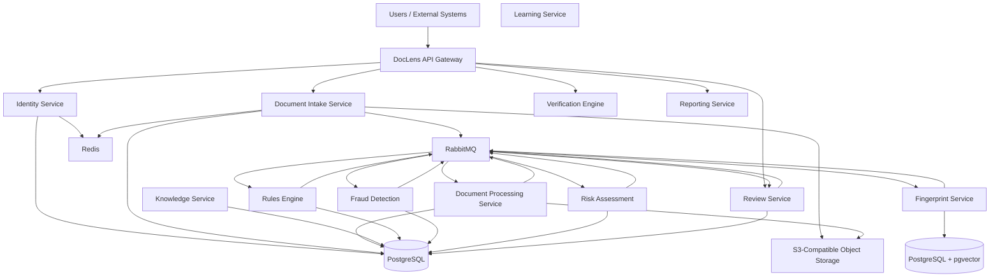
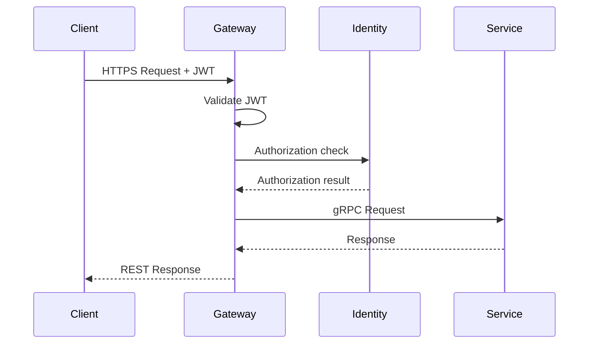
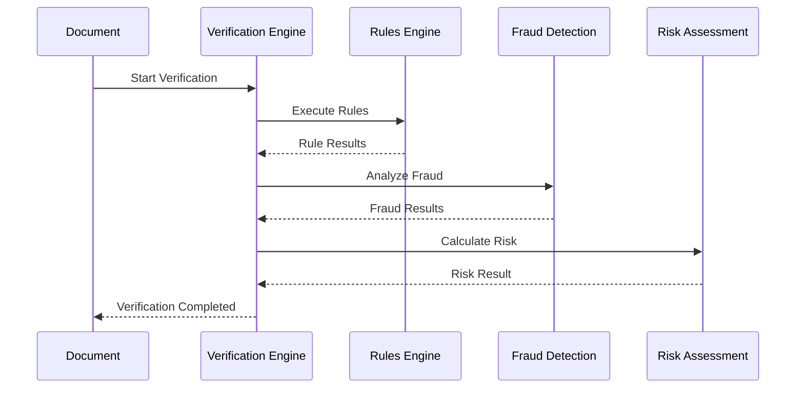
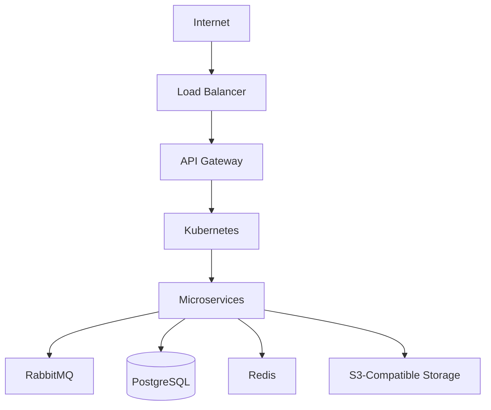
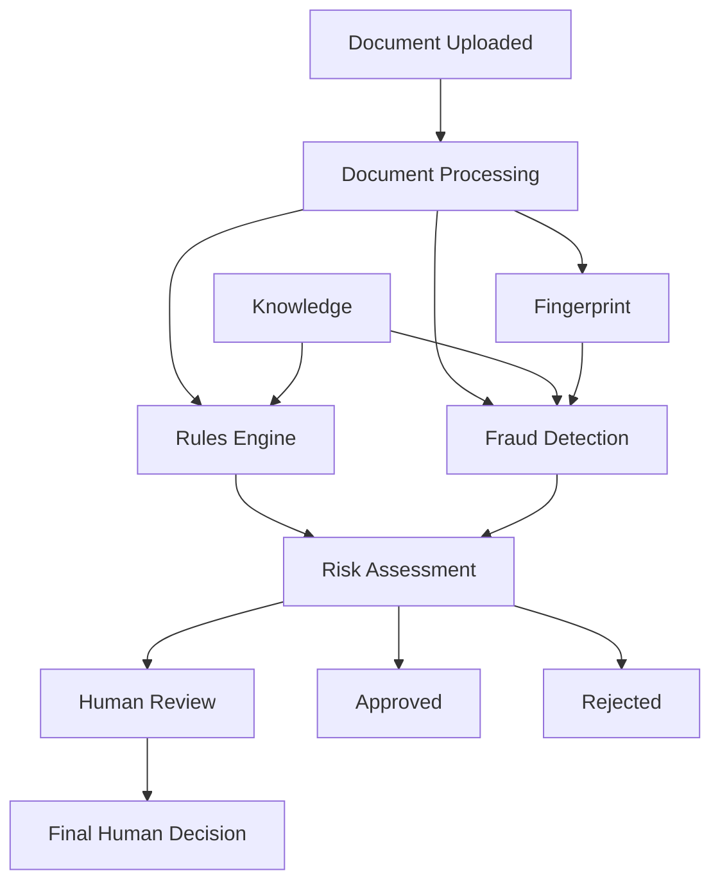

# DocLens Engineering Specification

**Status:** Unified Engineering Blueprint
**Project:** DocLens
**Architecture:** Production-oriented microservices architecture
**Primary API Style:** REST externally, gRPC internally
**Primary Database:** PostgreSQL
**Vector Search:** pgvector initially
**Event Broker:** RabbitMQ initially
**Object Storage:** S3-compatible storage
**Deployment:** Docker + Kubernetes
**AI/ML Services:** Python
**Infrastructure Services:** Go mainly but for specific engines or components the best language there should be used

---

# 1. System Context

## 1.1 Overview

DocLens is an AI-powered document verification platform designed to determine whether submitted documents are authentic, valid, internally consistent, and potentially fraudulent.

The system combines:

* deterministic validation,
* OCR and document understanding,
* image analysis,
* document fingerprinting,
* similarity detection,
* fraud analysis,
* risk scoring,
* human review,
* and eventually learning from historical verification outcomes.

DocLens is organized as a collection of independently deployable services. Each service owns a clearly defined business capability and its own persistent data.

Services communicate through two mechanisms:

1. **Synchronous APIs** for operations requiring an immediate response.
2. **Asynchronous events and background jobs** for processing pipelines and operations that do not require synchronous completion.

The architecture is intentionally designed so that expensive AI processing does not block the external API request lifecycle.

---

## 1.2 High-Level Architecture



---

# 2. Architectural Principles

## 2.1 Service Ownership

Each service owns its domain data.

A service must never directly query another service's database.

Instead, services communicate through:

* REST APIs,
* gRPC APIs,
* asynchronous events,
* or explicitly defined integration contracts.

This prevents database coupling and allows services to evolve independently.

---

## 2.2 Database-per-Service

The default rule is:

> A service owns its database and exposes APIs instead of allowing direct database access.

PostgreSQL may be deployed as a shared physical PostgreSQL cluster for operational simplicity, but services must still maintain logical database/schema ownership boundaries.

The architectural boundary is ownership, not necessarily one physical PostgreSQL server per service.

This avoids unnecessarily expensive infrastructure during the MVP while preserving service independence.

---

## 2.3 External REST, Internal gRPC

The communication model is:

```text
External Client
      |
      | REST/HTTPS
      v
API Gateway
      |
      | gRPC
      v
Internal Services
```

REST is preferred for:

* browser clients,
* mobile applications,
* external customers,
* third-party integrations.

gRPC is preferred for:

* low-latency internal calls,
* service-to-service communication,
* strongly typed contracts,
* high-frequency internal requests.

Asynchronous workflows use RabbitMQ rather than forcing every operation through synchronous RPC.

---

## 2.4 Event-Driven Processing

Long-running work should not remain inside an HTTP request.

Examples:

* OCR,
* document image analysis,
* embedding generation,
* fingerprinting,
* fraud analysis,
* report generation.

These operations should be executed through workers and asynchronous jobs.

---

## 2.5 AI Services Are Not the System of Record

AI/ML services generate evidence, scores, classifications, and derived information.

They should not independently decide the final business outcome unless explicitly defined to do so.

For example:

```text
Document Processing
        |
        v
Extracted Evidence
        |
        +----> Rules Engine
        |
        +----> Fingerprint Service
        |
        +----> Fraud Detection
                    |
                    v
              Risk Assessment
                    |
                    v
             Final Decision
```

This separation keeps deterministic business rules distinct from probabilistic AI outputs.

---

# 3. Service Catalog

| Service                     | Domain       | Primary Responsibility               |
| --------------------------- | ------------ | ------------------------------------ |
| API Gateway                 | Platform     | External access, routing, policies   |
| Identity Service            | Identity     | Users, authentication, authorization |
| Document Intake Service     | Document     | Upload and document lifecycle        |
| Document Processing Service | AI           | OCR, extraction, image analysis      |
| Fingerprint Service         | AI           | Hashing, embeddings, similarity      |
| Knowledge Service           | Verification | Trusted reference data               |
| Rules Engine                | Verification | Deterministic validation             |
| Verification Engine         | Verification | Verification orchestration           |
| Fraud Detection             | AI           | Fraud and tampering analysis         |
| Risk Assessment             | Verification | Final risk calculation               |
| Review Service              | Operations   | Human investigation                  |
| Reporting Service           | Reporting    | Reports and exports                  |
| Learning Service            | AI           | Model/rule improvement               |

Reporting and Learning are intentionally deferred until Phase 3.

---

# 4. Service Specifications

# 4.1 API Gateway

## Purpose

The API Gateway is the unified external entry point into DocLens.

The initial implementation will be written in **Go**.

## Responsibilities

* Request routing
* Authentication enforcement
* Authorization enforcement
* Rate limiting
* Request validation
* Request/response logging
* Request IDs
* Metrics
* API policies
* External API versioning
* Error normalization

## Communication

External:

```text
Client -> HTTPS/REST -> Gateway
```

Internal:

```text
Gateway -> gRPC -> Internal Services
```

## Request Flow



The Gateway must not contain core business logic belonging to domain services.

---

# 4.2 Identity Service

## Purpose

Owns identity and access management for DocLens.

The initial implementation should use a lightweight custom Identity Service rather than requiring Keycloak for the MVP.

Enterprise identity federation can be added later.

## Technology

* Go
* gRPC
* PostgreSQL
* Redis

## Database Ownership

Owns:

* `users`
* `organizations`
* `roles`
* `permissions`
* `sessions`
* `refresh_tokens`

## APIs

```http
POST /identity/users
POST /identity/login
POST /identity/refresh
POST /identity/logout
GET  /identity/users/{id}
```

## Events Produced

* `UserCreated`
* `UserRoleChanged`
* `UserDisabled`
* `OrganizationCreated`

`OrganizationCreated` is produced by Identity Service because Identity owns organization creation.

## Authentication

Initial authentication model:

* OAuth2-compatible flows
* JWT access tokens
* refresh tokens
* RBAC

---

# 4.3 Document Intake Service

## Purpose

Responsible for accepting documents and managing their lifecycle before processing.

## Responsibilities

* Create logical document records
* Accept uploads
* Validate upload metadata
* Store files in object storage
* Associate uploads with documents
* Track processing jobs
* Prevent unauthorized document access
* Emit upload events

## Database Ownership

Owns:

* `documents`
* `uploads`
* `processing_jobs`

### `documents`

Represents the **logical document** being verified.

Example:

```text
document_id = doc_123
type = national_id
organization_id = org_123
status = processing
```

### `uploads`

Represents a **physical file received by the system**.

This distinction allows one logical document to contain multiple physical uploads.

For example:

```text
Logical Document
      |
      +-- Front image
      |
      +-- Back image
```

Neither table stores the actual document bytes.

They store a reference to object storage:

```text
storage_ref
```

## Object Storage

Document files are stored in S3-compatible object storage.

The initial architecture supports:

* AWS S3
* self-hosted MinIO
* other S3-compatible providers

The application should interact through an object-storage abstraction rather than hardcoding a provider.

## APIs

```http
POST /documents
GET  /documents/{id}
POST /documents/{id}/uploads
GET  /documents/{id}/status
```

## Events Produced

* `DocumentUploaded`

## Events Consumed

* `UserCreated`

---

# 4.4 Document Processing Service

## Purpose

Transforms raw documents into structured machine-readable evidence.

## Technology

Python + FastAPI + asynchronous workers.

## Responsibilities

* OCR
* Text extraction
* Field extraction
* Metadata extraction
* Image analysis
* Document classification
* Image quality checks
* Preprocessing
* Normalization

## Input

```text
DocumentUploaded
```

## Output

```text
DocumentProcessed
```

Example extracted structure:

```json
{
  "document_id": "doc_123",
  "document_type": "national_id",
  "extracted_fields": {
    "full_name": "...",
    "document_number": "...",
    "date_of_birth": "...",
    "expiry_date": "..."
  }
}
```

## AI Architecture

The exact OCR/document-AI provider remains an implementation decision.

The service must therefore isolate the OCR/model layer behind an internal interface.

Possible implementations can include:

* open-source OCR,
* self-hosted document models,
* managed document-AI APIs,
* custom models.

The rest of DocLens must not depend directly on the chosen OCR vendor.

---

# 4.5 Fingerprint Service

## Purpose

Creates durable representations of documents that allow DocLens to identify duplicates, related documents, and similarity patterns.

## Responsibilities

* Cryptographic document hashes
* Perceptual hashes
* Embeddings
* Similarity search
* Duplicate detection
* Near-duplicate detection

## Storage

Initial decision:

> Use PostgreSQL + pgvector for the MVP.

A dedicated vector database such as Qdrant can be introduced later if scale or similarity workload justifies it.

This keeps the initial architecture simpler and reduces the number of operational systems.

## Data Model

The service may maintain:

```text
document_hash
perceptual_hash
embedding
embedding_model_version
created_at
```

## Events

Consumes:

```text
DocumentProcessed
```

Produces:

```text
FingerprintCreated
```

Example:

```json
{
  "event_id": "evt_123",
  "document_id": "doc_456",
  "hash": "...",
  "duplicate_of": null,
  "timestamp": "..."
}
```

---

# 4.6 Knowledge Service

## Purpose

The Knowledge Service stores trusted reference information used by the verification system.

It represents the authoritative reference layer against which documents are evaluated.

## Responsibilities

* Document templates
* Expected field structures
* Document type definitions
* Issuer-specific reference data
* Number formats
* Checksums
* Structural reference information
* Template versions

Knowledge must be versioned.

A verification performed in 2027 must remain explainable using the reference data that existed when the verification occurred.

## Example

```text
National ID
    |
    +-- Issuing Authority
    +-- Required Fields
    +-- Number Format
    +-- Checksum
    +-- Template Version
```

## APIs

```http
GET  /knowledge/templates/{document_type}
POST /knowledge/templates
GET  /knowledge/reference-data/{document_type}
```

Administrative operations must require elevated permissions.

## Open Decision

The initial document types supported by DocLens must be defined before the Knowledge Service is fully implemented.

---

# 4.7 Rules Engine

## Purpose

The Rules Engine performs deterministic, explainable verification.

It represents the non-AI portion of verification.

## Responsibilities

* Required-field validation
* Field format validation
* Checksum validation
* Date validation
* Expiration validation
* Issuer-specific rules
* Structural validation

## Example

```text
Document:
    expiry_date = 2025-03-01

Current date:
    2026-08-25

Rule:
    expiry_date >= current_date

Result:
    FAIL
```

The Rules Engine should explain every result.

## API

```http
POST /rules/execute
```

Example response:

```json
{
  "document_id": "doc_123",
  "results": [
    {
      "rule_id": "expiry_date_valid",
      "passed": false,
      "detail": "Document has expired"
    }
  ],
  "overall": "fail"
}
```

## Event

Produces:

```text
RuleCheckCompleted
```

Consumes:

```text
DocumentProcessed
```

## Rule Authoring

The exact rule-authoring mechanism remains an open implementation decision.

The architecture should allow rules to be modified without rewriting the Rules Engine itself.

---

# 4.8 Fraud Detection Service

## Purpose

Fraud Detection identifies suspicious manipulation and tampering that deterministic rules cannot reliably detect.

## Technology

Python + ML/CV infrastructure.

## Responsibilities

Potential signals include:

* Image manipulation
* Splicing
* Altered text
* Font inconsistencies
* Clone detection
* Signature manipulation
* Layout anomalies
* Image-level artifacts
* AI-generated or manipulated imagery
* Cross-document similarity signals

## Inputs

Fraud Detection can consume:

* Document Processing results
* Fingerprint results
* Knowledge Service references
* Original document images

## Output

The service produces evidence rather than the final business decision.

Example:

```json
{
  "document_id": "doc_123",
  "fraud_score": 78,
  "indicators": [
    {
      "type": "image_manipulation",
      "confidence": 0.91,
      "detail": "..."
    }
  ]
}
```

## API

```http
POST /fraud/analyze
```

## Event

Produces:

```text
FraudCheckCompleted
```

Consumes:

```text
DocumentProcessed
FingerprintCreated
```

## Critical Open Decision

The exact fraud-detection model architecture has not yet been finalized.

Possible approaches include:

* classical ML,
* computer-vision tamper detection,
* multimodal models,
* hybrid systems.

This decision depends on the available training data, target document types, required accuracy, inference cost, and fraud patterns.

The service must therefore isolate model implementations behind a stable inference interface.

---

# 4.9 Risk Assessment Service

## Purpose

Risk Assessment combines deterministic and probabilistic evidence into a single risk assessment.

## Inputs

* Rules Engine results
* Fraud Detection results
* Fingerprint/similarity signals
* Other verification evidence as the system evolves

## Output

```json
{
  "document_id": "doc_123",
  "risk_score": 20,
  "status": "approved"
}
```

Supported statuses:

```text
approved
rejected
flagged_for_review
```

## Responsibility Boundary

Fraud Detection does not make the final business decision.

Rules Engine does not make the final business decision.

Risk Assessment owns the combination of evidence into the risk result.

## API

```http
POST /risk/assess
```

## Event

Produces:

```text
VerificationCompleted
```

## Risk Thresholds

Thresholds should be configurable rather than hardcoded.

Example:

```text
0–29    -> approved
30–69   -> flagged_for_review
70–100  -> rejected
```

These numbers are illustrative only.

The actual thresholds are a business/compliance decision.

---

# 4.10 Verification Engine

## Purpose

Coordinates the verification workflow.

The Verification Engine should act as an orchestration layer rather than duplicating the responsibilities of Rules Engine, Fraud Detection, or Risk Assessment.

## Workflow



## Architecture

The preferred design is for Verification Engine to be **stateless orchestration**.

It coordinates services but should not become another source of truth.

If persistent verification records are required, ownership must be assigned explicitly to one service.

The system must not maintain competing `verification_records` tables in both Verification Engine and Risk Assessment.

## APIs

```http
POST /verification/start
GET  /verification/{id}
```

---

# 4.11 Review Service

## Purpose

Provides human investigation for documents that cannot safely be auto-approved or rejected.

## Responsibilities

* Review queue
* Reviewer assignment
* Evidence presentation
* Original document access
* Rule-result presentation
* Fraud-indicator presentation
* Reviewer decisions
* Reviewer notes
* Audit trail

## APIs

```http
GET  /review/queue
GET  /review/{document_id}
POST /review/{document_id}/decision
```

## Review Decisions

```text
approved
rejected
request_more_information
```

## Event

Produces:

```text
HumanReviewCompleted
```

## Event Consumption

Review Service consumes:

```text
VerificationCompleted
```

and filters:

```text
status = flagged_for_review
```

There is no separate `VerificationFailed` event.

---

# 4.12 Reporting Service

## Phase

Phase 3.

## Responsibilities

* Verification reports
* Organization reports
* Export functionality
* Historical analytics
* Operational reporting

The Reporting Service should consume events rather than querying other services' databases directly.

---

# 4.13 Learning Service

## Phase

Phase 3.

## Responsibilities

* Model improvement
* Rule improvement
* Training-data preparation
* Feedback analysis
* Reviewer-decision analysis
* Model evaluation

The service should use human-review outcomes as labeled feedback.

Important event:

```text
HumanReviewCompleted
```

This allows future versions of DocLens to learn from real verification outcomes.

---

# 5. Service Ownership Matrix

| Service             | Data Ownership                           | APIs              | Publishes                                                               | Consumes                                    |
| ------------------- | ---------------------------------------- | ----------------- | ----------------------------------------------------------------------- | ------------------------------------------- |
| Identity            | Users, organizations, roles, permissions | `/identity/*`     | `UserCreated`, `OrganizationCreated`, `UserRoleChanged`, `UserDisabled` | —                                           |
| Document Intake     | Documents, uploads, processing jobs      | `/documents/*`    | `DocumentUploaded`                                                      | `UserCreated`                               |
| Processing          | Processing results                       | `/processing/*`   | `DocumentProcessed`                                                     | `DocumentUploaded`                          |
| Fingerprint         | Hashes, embeddings, similarity data      | `/fingerprint/*`  | `FingerprintCreated`                                                    | `DocumentProcessed`                         |
| Knowledge           | Templates and reference data             | `/knowledge/*`    | Reference-data events as required                                       | Administrative events                       |
| Rules Engine        | Rule definitions and execution results   | `/rules/*`        | `RuleCheckCompleted`                                                    | `DocumentProcessed`                         |
| Fraud Detection     | Fraud analysis results/model metadata    | `/fraud/*`        | `FraudCheckCompleted`                                                   | `DocumentProcessed`, `FingerprintCreated`   |
| Risk Assessment     | Risk assessments                         | `/risk/*`         | `VerificationCompleted`                                                 | `RuleCheckCompleted`, `FraudCheckCompleted` |
| Verification Engine | Orchestration state if required          | `/verification/*` | —                                                                       | Verification inputs                         |
| Review              | Review cases and reviewer decisions      | `/review/*`       | `HumanReviewCompleted`                                                  | `VerificationCompleted`                     |
| Reporting           | Reporting/analytics data                 | `/reports/*`      | —                                                                       | Domain events                               |
| Learning            | Training/evaluation metadata             | `/learning/*`     | Model events                                                            | Review and verification events              |

---

# 6. Event Architecture

## 6.1 Event Broker

The initial event broker is:

**RabbitMQ**

RabbitMQ is preferred for the initial DocLens architecture because the early system primarily needs:

* reliable asynchronous jobs,
* work queues,
* acknowledgements,
* retries,
* dead-letter queues,
* worker distribution.

Kafka can be introduced later if DocLens develops requirements for:

* very high event throughput,
* long-lived event streams,
* event replay at large scale,
* complex stream processing,
* large analytics pipelines.

---

## 6.2 Event Contract

Events should contain a stable envelope.

Example:

```json
{
  "event_id": "evt_123",
  "event_type": "DocumentUploaded",
  "event_version": 1,
  "occurred_at": "2026-08-25T12:00:00Z",
  "organization_id": "org_123",
  "document_id": "doc_456",
  "payload": {}
}
```

Consumers must use `event_type` and `event_version` rather than relying on undocumented payload assumptions.

---

## 6.3 DocumentUploaded

Topic/routing key:

```text
document.uploaded
```

Example:

```json
{
  "event_id": "evt_123",
  "event_type": "DocumentUploaded",
  "event_version": 1,
  "document_id": "doc_456",
  "organization_id": "org_123",
  "type": "certificate"
}
```

Consumers:

* Document Processing
* Fingerprint Service

---

## 6.4 DocumentProcessed

```json
{
  "event_id": "evt_124",
  "event_type": "DocumentProcessed",
  "event_version": 1,
  "document_id": "doc_456",
  "organization_id": "org_123",
  "document_type": "certificate",
  "extracted_fields": {},
  "timestamp": "..."
}
```

Consumers may include:

* Fingerprint Service
* Rules Engine
* Fraud Detection

---

## 6.5 FingerprintCreated

```json
{
  "event_id": "evt_125",
  "event_type": "FingerprintCreated",
  "event_version": 1,
  "document_id": "doc_456",
  "hash": "...",
  "duplicate_of": null,
  "timestamp": "..."
}
```

---

## 6.6 RuleCheckCompleted

```json
{
  "event_id": "evt_126",
  "event_type": "RuleCheckCompleted",
  "event_version": 1,
  "document_id": "doc_456",
  "results": [],
  "overall": "pass",
  "timestamp": "..."
}
```

---

## 6.7 FraudCheckCompleted

```json
{
  "event_id": "evt_127",
  "event_type": "FraudCheckCompleted",
  "event_version": 1,
  "document_id": "doc_456",
  "fraud_score": 12,
  "indicators": [],
  "timestamp": "..."
}
```

---

## 6.8 VerificationCompleted

```json
{
  "event_id": "evt_128",
  "event_type": "VerificationCompleted",
  "event_version": 1,
  "verification_id": "ver_123",
  "document_id": "doc_456",
  "risk_score": 20,
  "status": "approved",
  "timestamp": "..."
}
```

Valid statuses:

```text
approved
rejected
flagged_for_review
```

A separate `VerificationFailed` event is not required.

---

## 6.9 HumanReviewCompleted

```json
{
  "event_id": "evt_129",
  "event_type": "HumanReviewCompleted",
  "event_version": 1,
  "document_id": "doc_456",
  "reviewer_id": "usr_789",
  "decision": "approved",
  "notes": "...",
  "timestamp": "..."
}
```

---

# 7. Communication Architecture

| Communication         | Technology                         |
| --------------------- | ---------------------------------- |
| Client → Gateway      | REST/HTTPS                         |
| Gateway → Services    | gRPC                               |
| Service → Service     | gRPC where synchronous             |
| Service → Service     | RabbitMQ events where asynchronous |
| Background processing | RabbitMQ + workers                 |
| External integrations | REST/Webhooks as appropriate       |

The system should avoid using asynchronous events where the caller genuinely needs an immediate response.

Conversely, expensive processing should not be forced into synchronous HTTP requests.

---

# 8. Database and Storage Architecture

## 8.1 PostgreSQL

PostgreSQL is the primary transactional database.

It is used for:

* Identity
* Document metadata
* Processing metadata
* Knowledge
* Rules
* Fraud results
* Risk assessments
* Reviews

The MVP can use a PostgreSQL cluster while maintaining strict logical ownership boundaries.

---

## 8.2 pgvector

The initial vector database strategy is:

> PostgreSQL + pgvector.

This allows DocLens to keep transactional and vector infrastructure relatively simple during the MVP.

A dedicated vector database such as Qdrant should only be introduced when justified by:

* millions of embeddings,
* heavy similarity-search workloads,
* multiple embedding types,
* latency requirements,
* large-scale fraud discovery.

---

## 8.3 Redis

Redis is used for temporary, high-speed data.

Potential uses:

* Session state
* Rate limiting
* Authentication acceleration
* Frequently accessed metadata
* Short-lived locks
* Cache entries
* Job coordination where appropriate

Redis is not the authoritative system of record.

---

## 8.4 Object Storage

Actual document files must not be stored directly in PostgreSQL.

Use S3-compatible object storage.

Example architecture:

```text
Document Intake
      |
      v
Object Storage
      |
      +----> original document
      +----> processed images
      +----> derived artifacts
```

Database records contain:

```text
storage_ref
```

rather than binary document contents.

Supported deployment options include:

* AWS S3
* MinIO
* other S3-compatible providers

---

# 9. Multi-Tenancy

DocLens is organization-oriented.

All tenant-owned resources should carry an `organization_id` or equivalent tenant identifier.

Example:

```text
documents
    organization_id

verification_records
    organization_id

review_cases
    organization_id
```

Every service must enforce tenant boundaries at the application/data-access layer.

## Open Decision

The exact isolation strategy remains to be finalized:

1. Shared tables + `organization_id`
2. Separate schema per organization
3. Separate database per organization

For the MVP, the architecture should be designed so the first strategy can be implemented without preventing future migration to stronger isolation.

---

# 10. Deployment Architecture

## 10.1 Containerization

Every service should be packaged as a container.

Example:

```text
doclens-gateway
doclens-identity
doclens-document-intake
doclens-processing
doclens-fingerprint
doclens-knowledge
doclens-rules
doclens-verification
doclens-fraud
doclens-risk
doclens-review
```

---

## 10.2 Kubernetes

Production deployment uses Kubernetes.

Each service should have:

* Deployment
* Service
* ConfigMap
* Secrets
* Horizontal Pod Autoscaler where appropriate
* Resource requests/limits
* Readiness probe
* Liveness probe

AI services may require different resource profiles from ordinary API services.

For example:

```text
Gateway
    CPU-oriented

Processing
    CPU/GPU depending on models

Fraud Detection
    CPU/GPU depending on model

Identity
    CPU-oriented

Workers
    horizontally scalable
```

---

## 10.3 Deployment Flow



---

## 10.4 Infrastructure as Code

Infrastructure should eventually be managed through:

* Terraform
* Kubernetes manifests/Helm
* CI/CD pipelines

The exact cloud provider remains an infrastructure decision.

---

# 11. Observability

Observability is mandatory because DocLens contains distributed asynchronous workflows.

## 11.1 Logging

Every service emits structured JSON logs.

Example:

```json
{
  "timestamp": "2026-08-25T12:00:00Z",
  "request_id": "req_123",
  "trace_id": "trace_456",
  "service": "verification",
  "operation": "start_verification",
  "duration_ms": 230,
  "status": "success"
}
```

Logs must not accidentally expose:

* passwords,
* tokens,
* raw sensitive document contents,
* unnecessary PII.

---

## 11.2 Metrics

Track at minimum:

### API

* Request count
* Request latency
* Error rate
* HTTP status distribution

### Processing

* Documents processed
* OCR latency
* Processing failures
* Queue latency
* Processing throughput

### AI

* Inference latency
* Model errors
* Model throughput
* GPU/CPU utilization where applicable

### RabbitMQ

* Queue depth
* Consumer count
* Message age
* Retry count
* Dead-letter count

### Verification

* Approval rate
* Rejection rate
* Review rate
* Average verification duration

---

## 11.3 Observability Stack

Initial recommended stack:

```text
OpenTelemetry
      |
      +----> Metrics
      +----> Traces
      +----> Logs

Prometheus -> Metrics
Grafana    -> Dashboards
Loki       -> Logs
Tempo/Jaeger-compatible backend -> Traces
```

OpenTelemetry should provide the instrumentation layer so the tracing backend can be changed later without rewriting application instrumentation.

---

# 12. Failure Handling

All asynchronous consumers should implement a consistent failure strategy.

The pattern is:

```text
Message
   |
   v
Consumer
   |
   +---- success ---> ACK
   |
   +---- failure
          |
          v
       Retry
          |
          +---- success ---> ACK
          |
          +---- repeated failure
                    |
                    v
                  DLQ
                    |
                    v
              Operations Alert
```

This applies to every asynchronous consumer, not only Fraud Detection.

---

## 12.1 Retry Strategy

Initial retry policy should use:

* limited retry count,
* exponential backoff,
* dead-letter queues,
* operational alerts.

Exact retry counts and backoff values should be configurable rather than hardcoded into individual services.

---

## 12.2 Idempotency

Event consumers must be designed to safely handle duplicate delivery.

Each event contains:

```text
event_id
```

Consumers should maintain enough state to avoid executing non-idempotent operations multiple times.

This is important because RabbitMQ-based systems can encounter redelivery.

---

# 13. Security Specification

## 13.1 Authentication

Initial authentication uses:

* OAuth2-compatible flows
* JWT access tokens
* refresh tokens

The Identity Service owns authentication state.

---

## 13.2 Authorization

Use RBAC.

Example roles:

```text
platform_admin
org_admin
reviewer
analyst
user
```

Permissions should be explicit rather than relying only on role names.

---

## 13.3 Transport Security

External communication:

```text
HTTPS/TLS
```

Internal service communication:

```text
gRPC over TLS
```

The exact service-to-service authentication mechanism remains an architectural decision.

Potential approaches include:

* mTLS,
* internal service-account JWTs,
* workload identity,
* network-policy-based trust.

This should be finalized before production deployment.

---

## 13.4 Encryption at Rest

Sensitive information must be encrypted at rest.

This applies to:

* PostgreSQL
* Redis where appropriate
* Object storage
* backups
* secrets

---

## 13.5 Audit Logging

Audit events must cover:

* Document uploads
* Document access where required
* Verification decisions
* Rule changes
* Reviewer actions
* Administrative changes
* Authentication/security events

Audit records should be immutable or protected against ordinary application modification.

---

# 14. Data Protection and Compliance

DocLens may process highly sensitive documents.

The architecture must therefore treat document contents and extracted fields as sensitive data.

## Required policies

Before production use, define:

* Data classification
* Document retention period
* Extracted-field retention period
* Audit-log retention
* Backup retention
* Deletion procedures
* User deletion requests
* Organization deletion
* Data export
* Encryption-key management
* Geographic data residency

## Regulatory Scope

The exact regulatory requirements depend on DocLens's target markets and must be established before processing real customer data.

Compliance requirements must not be assumed by engineering agents.

---

# 15. Verification Architecture

The core verification pipeline is:



This creates a layered verification model:

### Layer 1 — Document Understanding

```text
OCR
Extraction
Classification
Image analysis
```

### Layer 2 — Deterministic Verification

```text
Required fields
Formats
Checksums
Dates
Templates
```

### Layer 3 — Similarity Intelligence

```text
Hashes
Embeddings
Duplicate detection
```

### Layer 4 — Fraud Intelligence

```text
Tampering
Manipulation
Anomalies
Forgery indicators
```

### Layer 5 — Risk Assessment

```text
All evidence
    |
    v
Risk score
    |
    +-- approved
    +-- rejected
    +-- human review
```

---

# 16. API Design Principles

APIs should be:

* versioned,
* authenticated,
* documented,
* idempotent where appropriate,
* observable,
* backward compatible.

External APIs should use:

```text
/api/v1/...
```

Internal service APIs may use gRPC package/version namespaces.

---

## 16.1 Error Format

All HTTP APIs should return a consistent structure.

Example:

```json
{
  "error": {
    "code": "DOCUMENT_NOT_FOUND",
    "message": "The requested document does not exist",
    "request_id": "req_123"
  }
}
```

Internal errors must not expose stack traces or sensitive infrastructure information to external clients.

---

# 17. Repository and Code Organization

A monorepo can initially simplify development and shared tooling.

Example:

```text
doclens/
├── services/
│   ├── gateway/
│   ├── identity/
│   ├── document-intake/
│   ├── processing/
│   ├── fingerprint/
│   ├── knowledge/
│   ├── rules/
│   ├── verification/
│   ├── fraud/
│   ├── risk/
│   └── review/
│
├── packages/
│   ├── contracts/
│   ├── protobuf/
│   └── shared/
│
├── infrastructure/
│   ├── docker/
│   ├── kubernetes/
│   └── terraform/
│
├── docs/
│
└── AGENTS.md
```

Shared code should be kept minimal.

Shared domain logic should generally remain inside the service that owns it.

Shared packages are appropriate for:

* generated protobuf code,
* common API types,
* logging interfaces,
* tracing instrumentation,
* infrastructure utilities.

---

# 18. Technology Stack

## Core

| Component                       | Technology       |
| ------------------------------- | ---------------- |
| API Gateway                     | Go               |
| AI/API Services                 | Python           |
| API Framework                   | FastAPI          |
| Internal RPC                    | gRPC             |
| External API                    | REST             |
| Primary Database                | PostgreSQL       |
| Vector Search                   | pgvector         |
| Cache                           | Redis            |
| Object Storage                  | S3-compatible    |
| Event Broker                    | RabbitMQ         |
| Background Workers              | Celery initially |
| Containers                      | Docker           |
| Orchestration                   | Kubernetes       |
| Infrastructure                  | Terraform        |
| CI/CD                           | GitHub Actions   |
| Metrics                         | Prometheus       |
| Dashboards                      | Grafana          |
| Logs                            | Loki             |
| Tracing                         | OpenTelemetry    |
| Search/analytics where required | OpenSearch       |

---

# 19. Architecture Decisions

The following decisions have already been established during architecture discussions.

## ADR-001 — PostgreSQL as Primary Database

**Decision:** PostgreSQL.

**Reason:**

* mature relational database,
* strong transactional guarantees,
* excellent Python support,
* suitable for multi-tenant application data,
* supports JSON where required,
* integrates with pgvector.

---

## ADR-002 — pgvector Before Dedicated Vector Database

**Decision:** Start with PostgreSQL + pgvector.

**Reason:**

The MVP does not need another specialized infrastructure system unless similarity workloads justify it.

Qdrant remains a future scaling option.

---

## ADR-003 — RabbitMQ Before Kafka

**Decision:** RabbitMQ initially.

**Reason:**

DocLens initially requires:

* background jobs,
* worker queues,
* retries,
* acknowledgements,
* dead-letter queues.

Kafka should be introduced only when event-streaming requirements justify its operational complexity.

---

## ADR-004 — REST Externally, gRPC Internally

**Decision:**

```text
External -> REST
Internal -> gRPC
```

This provides a simple public interface while maintaining strongly typed, efficient internal communication.

---

## ADR-005 — Python for AI Services

**Decision:** Python + FastAPI.

Python is preferred for:

* OCR,
* computer vision,
* ML,
* document processing,
* model serving,
* AI experimentation.

---

## ADR-006 — Go for API Gateway

**Decision:** Go.

The Gateway is infrastructure-oriented and benefits from:

* low resource usage,
* strong concurrency,
* predictable performance,
* straightforward deployment.

---

## ADR-007 — Lightweight Identity Service Initially

**Decision:** Build the initial Identity Service rather than introducing Keycloak immediately.

Enterprise identity providers and federation can be introduced later when requirements justify them.

---

## ADR-008 — S3-Compatible Object Storage

**Decision:** Documents are stored in object storage rather than PostgreSQL.

S3 compatibility keeps the application portable across:

* AWS,
* self-hosted MinIO,
* other compatible providers.

---

# 20. Open Architectural Decisions

These decisions remain intentionally unresolved.

They must not be silently chosen by implementation agents.

## 20.1 Document Types

What document classes are supported in V1?

Examples might include:

* national IDs,
* passports,
* certificates,
* invoices,
* licenses.

The final decision determines the Knowledge Service model.

---

## 20.2 OCR / Document AI

Choose between:

* managed document-AI API,
* open-source models,
* self-hosted models,
* custom models,
* hybrid architecture.

The abstraction layer should be built before the provider is permanently coupled to the service.

---

## 20.3 Fraud Detection Model

Determine whether the first fraud system uses:

* classical ML,
* computer vision,
* multimodal models,
* hybrid models.

This decision depends heavily on training data and the exact fraud patterns DocLens targets.

---

## 20.4 Rule Authoring

Determine whether rules are:

* stored as structured JSON/DSL,
* implemented as code,
* or powered by a dedicated rules library.

The system should keep rule definitions separate from the Rules Engine execution infrastructure.

---

## 20.5 Verification Record Ownership

Preferred architecture:

```text
Verification Engine = orchestration
Risk Assessment = risk decision
```

However, the exact ownership of persistent verification records must be finalized so there is only one source of truth.

---

## 20.6 Multi-Tenant Isolation

Determine whether production tenancy uses:

* shared tables + `organization_id`,
* schema-per-tenant,
* database-per-tenant.

The application should initially be designed around explicit tenant boundaries so the strategy can evolve.

---

## 20.7 Cloud Provider

The Kubernetes architecture remains cloud-neutral.

The final deployment target must determine:

* managed Kubernetes,
* managed PostgreSQL,
* object storage,
* secrets management,
* load balancing,
* networking,
* monitoring.

---

## 20.8 Service-to-Service Authentication

Finalize:

* mTLS,
* internal JWT/service accounts,
* workload identity,
* or another zero-trust mechanism.

---

## 20.9 Data Retention and Compliance

Define:

* retention periods,
* deletion requirements,
* geographic restrictions,
* regulatory requirements,
* encryption-key ownership,
* backup retention.

---

## 20.10 Risk Thresholds

The business/compliance team must define the actual thresholds for:

```text
approved
flagged_for_review
rejected
```

Engineering should make these configurable rather than embedding business thresholds in code.

---

# 21. Implementation Roadmap

## Phase 1 — Platform Foundation

Build:

1. API Gateway
2. Identity Service
3. Document Intake Service
4. PostgreSQL
5. Redis
6. S3-compatible object storage
7. RabbitMQ
8. Background worker infrastructure
9. Document Processing Service
10. Basic observability

Initial flow:

```text
Client
  |
  v
Gateway
  |
  v
Identity
  |
  v
Document Intake
  |
  v
Object Storage
  |
  v
RabbitMQ
  |
  v
Processing
```

---

## Phase 2 — Verification Intelligence

Build:

1. Fingerprint Service
2. pgvector
3. Knowledge Service
4. Rules Engine
5. Fraud Detection
6. Risk Assessment
7. Verification Engine
8. Review Service

Flow:

```text
Document
    |
    v
Processing
    |
    +------> Fingerprint
    |
    +------> Rules
    |
    +------> Fraud
              |
              v
         Risk Assessment
              |
       +------+------+
       |      |      |
       v      v      v
    Approve Reject Review
```

---

## Phase 3 — Enterprise Platform

Build:

* Reporting Service
* Learning Service
* External APIs
* Analytics
* Advanced fraud models
* Advanced reporting
* Enterprise identity integrations
* Larger-scale vector infrastructure if required
* Advanced event streaming if Kafka becomes justified

---

# 22. Scaling Strategy

DocLens should scale individual workloads independently.

For example:

```text
Gateway
   3 replicas

Identity
   3 replicas

Processing
   10 workers

Fraud Detection
   GPU workers

Review
   3 replicas
```

The architecture should not require every service to scale together.

---

## 22.1 Horizontal Scaling

Stateless APIs should be horizontally scalable.

Workers should be scaled according to queue depth.

Example:

```text
Queue depth increases
        |
        v
More workers
        |
        v
Processing throughput increases
```

---

## 22.2 AI Scaling

AI workloads should be isolated from ordinary API workloads.

A GPU-intensive fraud model should not require the API Gateway or Identity Service to run on GPU-enabled nodes.

---

# 23. Reliability Requirements

Production services should provide:

* health endpoints,
* readiness checks,
* liveness checks,
* graceful shutdown,
* retry handling,
* idempotent consumers,
* timeouts,
* circuit breakers where appropriate,
* structured error handling.

No service should depend indefinitely on another service.

Every network call must have an explicit timeout.

---

# 24. Testing Strategy

Each service should contain:

## Unit Tests

Test:

* domain logic,
* validation,
* rule execution,
* transformations.

## Integration Tests

Test:

* PostgreSQL,
* Redis,
* RabbitMQ,
* object storage,
* service boundaries.

## Contract Tests

Verify:

* REST contracts,
* protobuf/gRPC contracts,
* event payloads.

## End-to-End Tests

Test the complete flow:

```text
Upload
  |
  v
Processing
  |
  v
Fingerprint
  |
  v
Rules
  |
  v
Fraud
  |
  v
Risk
  |
  +----> Approved
  +----> Rejected
  +----> Human Review
```

---

# 25. Engineering Rules for AI Agents

Implementation agents must follow these rules.

## Do not

* directly access another service's database,
* invent new service ownership,
* introduce Kafka before it is justified,
* introduce a dedicated vector database before pgvector is insufficient,
* embed business risk thresholds directly into application code,
* hardcode an OCR provider into the processing domain,
* hardcode a specific fraud model into the fraud domain,
* store document binaries in PostgreSQL,
* expose internal database models directly through public APIs,
* silently resolve open architectural decisions.

## Do

* respect service boundaries,
* use APIs/events for inter-service communication,
* version contracts,
* make asynchronous consumers idempotent,
* propagate correlation/request IDs,
* emit structured logs,
* instrument services with OpenTelemetry,
* protect tenant boundaries,
* write tests around service contracts,
* keep infrastructure configuration outside application logic.

---

# 26. Definition of Architectural Success

The DocLens architecture is successful when:

1. A document can be securely uploaded.
2. The original file is stored outside PostgreSQL.
3. Processing can occur asynchronously.
4. Extracted information is represented as structured evidence.
5. Documents can be fingerprinted and compared.
6. Deterministic rules can validate extracted information.
7. AI can identify suspicious manipulation.
8. Risk Assessment can combine all evidence.
9. Low-confidence cases can be routed to human review.
10. Every decision can be explained through stored evidence.
11. Services can scale independently.
12. Failures can be retried without corrupting state.
13. Tenant data remains isolated.
14. Sensitive data is auditable and protected.
15. The architecture can evolve from MVP infrastructure to enterprise infrastructure without rewriting domain logic.

---

# 27. Final Architecture

The resulting DocLens architecture is:

```text
                         ┌─────────────────────┐
                         │      Clients        │
                         └──────────┬──────────┘
                                    │
                                  REST
                                    │
                         ┌──────────▼──────────┐
                         │    API Gateway      │
                         │        Go           │
                         └──────────┬──────────┘
                                    │
                                  gRPC
                                    │
              ┌─────────────────────┼─────────────────────┐
              │                     │                     │
       ┌──────▼──────┐       ┌──────▼────────┐    ┌──────▼──────┐
       │   Identity  │       │ Document      │    │   Review    │
       │   Service   │       │ Intake        │    │   Service   │
       └─────────────┘       └──────┬────────┘    └─────────────┘
                                    │
                                    │ Event
                                    ▼
                              ┌────────────┐
                              │ RabbitMQ   │
                              └─────┬──────┘
                                    │
                  ┌─────────────────┼──────────────────┐
                  │                 │                  │
           ┌──────▼─────┐   ┌──────▼──────┐   ┌──────▼──────┐
           │ Processing │   │ Fingerprint │   │    Rules    │
           │   Python    │   │  pgvector   │   │   Engine    │
           └──────┬─────┘   └──────────────┘   └──────┬──────┘
                  │                                    │
                  │                                    │
                  └────────────────┬───────────────────┘
                                   │
                            ┌──────▼──────┐
                            │    Fraud    │
                            │  Detection  │
                            └──────┬──────┘
                                   │
                            ┌──────▼──────┐
                            │     Risk    │
                            │ Assessment  │
                            └──────┬──────┘
                                   │
                     ┌─────────────┼─────────────┐
                     │             │             │
                 Approved       Rejected       Review
                     │             │             │
                     └─────────────┴─────────────┘
```

The infrastructure layer underneath consists of:

```text
PostgreSQL
Redis
RabbitMQ
S3-compatible Object Storage
pgvector
Kubernetes
OpenTelemetry
Prometheus
Grafana
Loki
```

The resulting architecture deliberately balances **production-grade boundaries with MVP simplicity**.

It does not introduce Kafka, Qdrant, Keycloak, or other specialized infrastructure merely because they are common in large microservice systems. Those technologies remain available as future scaling/enterprise options when actual requirements justify their operational cost.

---

# 28. Engineering Decision Summary

| Area                | Decision                               |
| ------------------- | -------------------------------------- |
| Architecture        | Microservices                          |
| External API        | REST                                   |
| Internal API        | gRPC                                   |
| Gateway             | Custom Go service                      |
| Identity            | Custom Go/gRPC service initially       |
| AI Services         | Python/FastAPI                         |
| Primary DB          | PostgreSQL                             |
| Vector DB           | pgvector initially                     |
| Cache               | Redis                                  |
| Object Storage      | S3-compatible                          |
| Event Broker        | RabbitMQ                               |
| Background Workers  | Celery initially                       |
| Containers          | Docker                                 |
| Orchestration       | Kubernetes                             |
| Infrastructure      | Terraform                              |
| CI/CD               | GitHub Actions                         |
| Metrics             | Prometheus                             |
| Dashboards          | Grafana                                |
| Logs                | Loki                                   |
| Tracing             | OpenTelemetry                          |
| Search              | OpenSearch where required              |
| Dedicated Vector DB | Qdrant later if justified              |
| Streaming Platform  | Kafka later if justified               |
| Enterprise IAM      | Keycloak/federation later if justified |

---

# Conclusion

This document is the unified engineering blueprint for DocLens.

It combines the original engineering specification with the clarified service boundaries, database ownership model, event architecture, communication strategy, deployment architecture, security model, and the architectural decisions established during the project's design discussions.

The central design principle is:

> **Keep business capabilities independent, keep data ownership explicit, use synchronous APIs when an immediate answer is required, use asynchronous events for long-running work, and introduce specialized infrastructure only when the system has a demonstrated need for it.**

This provides DocLens with a practical path from MVP to a production-grade document verification platform without prematurely creating an unnecessarily complex distributed system.
