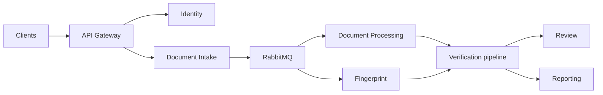

DocLens separates external access, domain ownership, asynchronous processing, and AI-derived evidence.

AI services produce evidence, scores, and classifications. They do not become the system of record for final business outcomes unless the specification explicitly assigns that responsibility.
